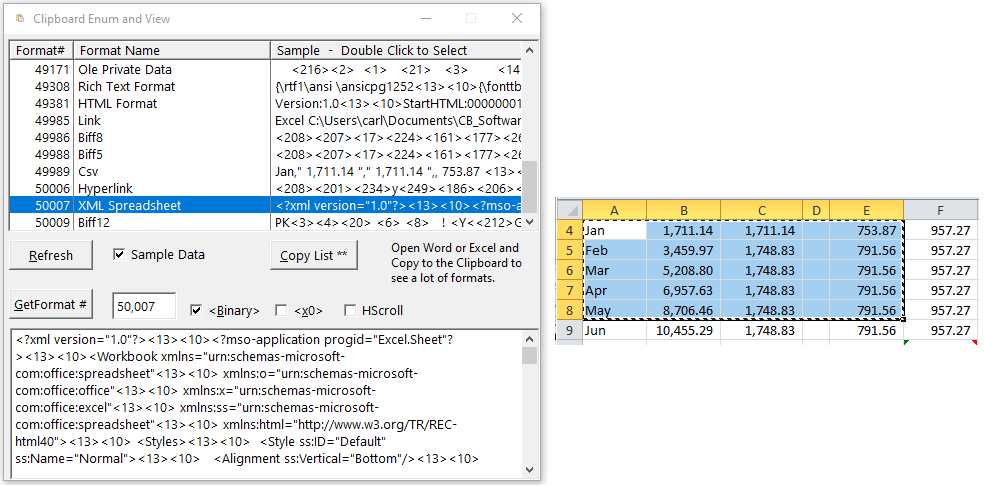

# ClipboardEnumViewer - Enumerate Clipboard Formats in Clarion

Simple program to call EnumClipboardFormats() and show all the formats. Can also view the clipboard data using the Clarion Clipboard() function. Calling the Windows API will be needed for many Formats.

Below is a screen capture of an Excel copy that shows many formats.

Excel Example:

Format# | Format Name
--------|------------
1 | CF_TEXT
2 | CF_BITMAP
3 | CF_METAFILEPICT
4 | CF_SYLK
5 | CF_DIF
7 | CF_OEMTEXT
8 | CF_DIB
13 | CF_UNICODETEXT
14 | CF_ENHMETAFILE
16 | CF_LOCALE
17 | CF_MAX
129 | CF_DSPTEXT
49154 | ObjectLink
49155 | OwnerLink
49156 | Native
49161 | DataObject
49163 | Embed Source
49165 | Link Source
49166 | Object Descriptor
49167 | Link Source Descriptor
49171 | Ole Private Data
49308 | Rich Text Format
49381 | HTML Format
49985 | Link
49986 | Biff8
49988 | Biff5
49989 | Csv
50006 | Hyperlink
50007 | XML Spreadsheet
50009 | Biff12
